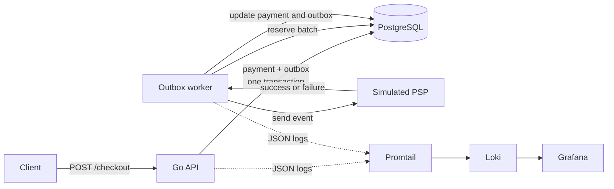

# Payments API

A personal project for exploring reliable payment processing in Go. 
It focuses on the failure modes around accepting a checkout request, 
storing work durably, and dispatching it to an external payment service 
from a separate worker.

> [!NOTE]
> This project is under active development. The payment service provider 
> is currently simulated, and the application is not intended for production use.

## What is implemented

- An HTTP API with health and checkout endpoints.
- Request idempotency backed by a unique `id_request` in PostgreSQL.
- Atomic creation of a payment and its outbox event in the same database transaction.
- A separate worker that polls and processes outbox events in batches.
- Concurrent-safe event reservation with `FOR UPDATE SKIP LOCKED`, expiring leases, and lock tokens.
- Exponential retry scheduling and a terminal `errored` state after `N` attempts.
- A circuit breaker that opens after repeated server or transport failures and later allows a recovery probe.
- Structured API, worker, and SQL logs with a local Grafana, Loki, and Promtail stack.
- Unit and integration tests backed by disposable PostgreSQL containers.

## Architecture



The API does not call the PSP during the checkout request. 
It commits the payment and an outbox event together, then returns the internal payment identifier. 
The worker claims available events and performs the external call independently.

## Reliability model

### Idempotent checkout

Each checkout request carries an `id_request` with the `request:checkout:` prefix. 
PostgreSQL enforces uniqueness on the persisted UUID. 
Reusing an accepted request ID returns `409 Conflict` instead of creating another payment.

### Transactional outbox

The payment row and outbox row are written in one transaction. 
This prevents the application from accepting a payment locally 
without also recording the work that the worker must process.

### Safe event reservation

Workers reserve eligible events with `FOR UPDATE SKIP LOCKED`. 
Each batch receives a lock token and a ten-minute lease. 
Updates require the same token, and expired leases allow abandoned work to be claimed again.

### Retries and circuit breaking

Failed events are scheduled with exponential delays and stop after five attempts. 
The circuit breaker reacts to simulated `5xx` responses and transport errors, 
pauses calls for 30 minutes after the error threshold is exceeded, 
and uses a recovery probe before closing again.

This is an at-least-once style workflow. 
A real PSP adapter still needs a provider-side idempotency key so that a successful external request
followed by a local persistence failure cannot create a duplicate charge.

## Tech stack

- Go and Gin
- PostgreSQL and `pgx`
- Docker Compose
- Testcontainers for Go, Testify, and the standard `testing` package
- `slog`, Promtail, Loki, and Grafana

## Project structure

```text
cmd/api/                  HTTP API entry point
cmd/worker/               Outbox worker entry point
internal/controller/      HTTP request handling
internal/usecases/        Checkout and outbox processing
internal/resilience/      Circuit breaker
internal/psp/             Simulated PSP adapter
internal/db/              Database models and configuration
migrations/               PostgreSQL schema and seed data
deploy/                   Local observability configuration
test/                     Shared Testcontainers setup
```

## Running locally

### Requirements

- Go version declared in `go.mod`
- Docker with Docker Compose
- Make

### 1. Start PostgreSQL

```bash
make db-up
```

Apply the schema and seed data:

```bash
docker compose exec db psql -U postgres -d payments \
  -f /migrations/001_initial_migration.sql
```

### 2. Start the API

```bash
make api
```

The API listens on `http://localhost:8080`.

### 3. Start the worker

In another terminal:

```bash
make worker
```

The worker checks for available outbox events every five seconds. 
The current PSP simulator randomly returns successful responses, rate limits, server errors, 
and transport errors so the recovery paths can be exercised locally.

### 4. Submit a checkout

The initial migration creates two sample accounts used by this request:

```bash
curl --request POST http://localhost:8080/checkout \
  --header 'Content-Type: application/json' \
  --data '{
    "id_request": "request:checkout:95f5b8a3-d4ec-4a05-b6ed-04f9b889674b",
    "id_source_account": "e4215def-6f52-4f3a-8cd7-23e261bad9e7",
    "id_destiny_account": "597cb0af-0562-496b-9802-94dc5b0f082d"
  }'
```

A successful request returns an internal payment ID:

```json
{
  "id_payment": "<uuid>"
}
```

Submitting the same `id_request` again returns `409 Conflict`.

## Observability

Create the log directory and start the local stack:

```bash
mkdir -p logs
docker compose -f docker-compose.observability.yml up -d
```

Open Grafana at `http://localhost:3000`. Loki is provisioned as a data source. 
The following labels separate API and worker logs:

```logql
{service="api", environment="dev"} | json
```

```logql
{service="worker", environment="dev"} | json
```

Set the log level when starting either process:

```bash
make api LOG_LEVEL=debug
make worker LOG_LEVEL=debug
```

## Tests

```bash
make tests
```

The integration tests start isolated PostgreSQL instances with Testcontainers and apply the migration 
automatically. They cover checkout idempotency, payment and outbox persistence, event reservation, 
retry transitions, successful processing, and circuit-breaker behavior.

## Current boundaries

- The PSP is a simulator, not a real third-party integration.
- The checkout flow does not move account balances.
- Authentication and authorization are not implemented.
- Local database configuration is still hardcoded.
- The worker does not yet implement graceful shutdown.

## Next steps

- [ ] Add a real PSP adapter with provider-side idempotency.
- [ ] Receive and deduplicate signed PSP webhooks.
- [ ] Move runtime configuration to environment variables.
- [ ] Add graceful shutdown and request timeouts.
- [ ] Add operational metrics for outbox lag, retries, failures, and circuit-breaker state.
- [ ] Add more concurrency test cases for the circuit breaker
- [ ] Adjust the worker so that it sends a batch of events to PSP in parallel
